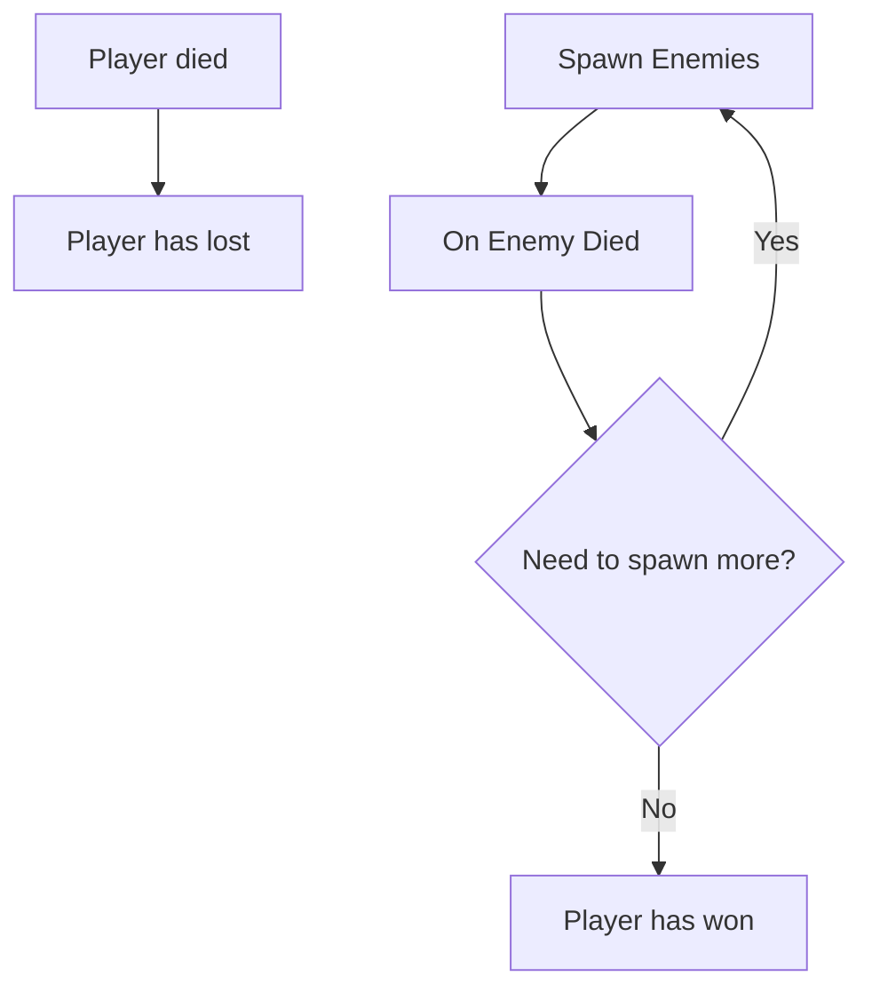

# `Survival Game Loop` #Done

```mermaid
flowchart TD
    A[Player has lost]
    B[Player died]
    C[Spawn Enemies]
    D[On Enemy Died]
    E{Need to spawn more?}
    H[Player has won]

    C --> D
    D --> E
    E -- Yes --> C
    E -- No --> H
    
    B --> A
```

---
# `Spawn Logic` #Done

- `Pre Load Enemy Class`
- `Spawn Enemy In Level`
- `Handle Spwan Count`

---
